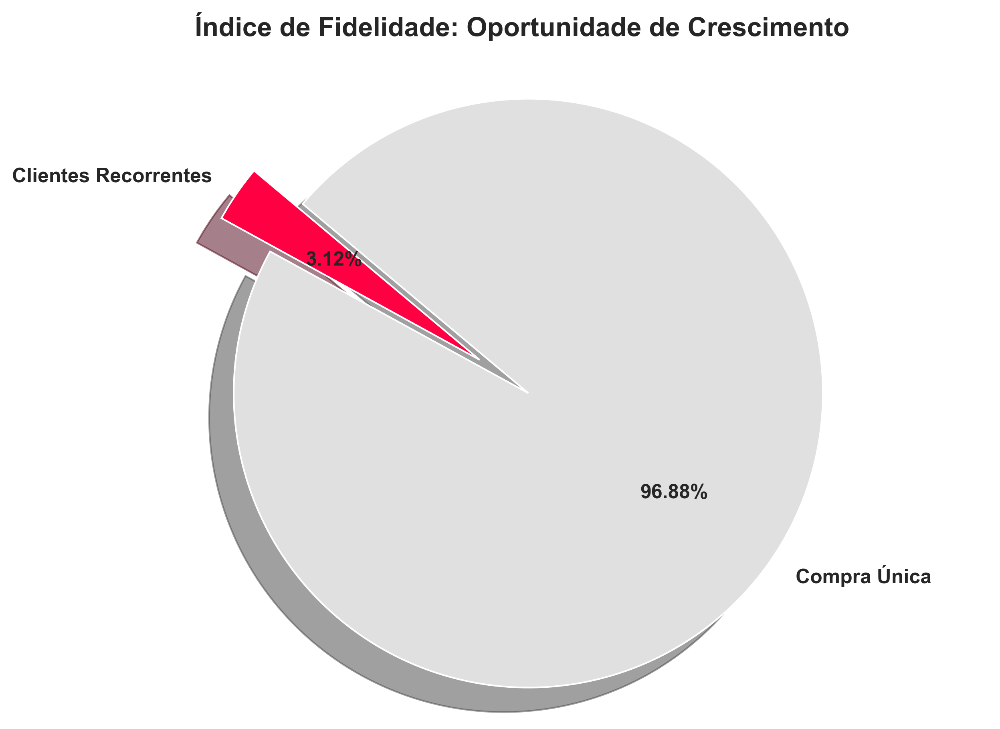

# Análise de Fidelidade e Retenção - E-commerce (Olist Dataset)

Este projeto tem como objetivo analisar o comportamento de compra e os índices de fidelidade de clientes em uma base de dados de e-commerce brasileiro (Olist). 

## 🚀 Status do Projeto
Este repositório está em desenvolvimento. O projeto foi dividido em duas fases:
* **Fase 1 (Concluída):** Extração de dados via SQL e análise exploratória (EDA) com Python.
* **Fase 2 (Em andamento):** Construção de dashboard interativo no Power BI.

## 📊 Principais Insights (Fase 1)

### Comportamento Geográfico e de Pagamentos
A análise inicial revela a dominância das regiões Sudeste e Sul em faturamento total. Entretanto, identificamos uma oportunidade estratégica nas regiões Norte e Nordeste, que apresentam tickets médios superiores, sugerindo um perfil de consumo de maior valor agregado.

### Índice de Fidelidade
A base de dados apresenta uma taxa de recorrência de **3,12%**. Este indicador é o ponto central da estratégia: converter uma fração dos clientes de compra única em clientes recorrentes pode gerar um aumento massivo de receita sem novos custos de aquisição (CAC).

## 🛠️ Tecnologias Utilizadas
* **SQL (MySQL):** Extração e modelagem dos dados.
* **Python (Pandas, Seaborn, Matplotlib):** Tratamento e visualização estatística.
* **Jupyter Notebook:** Documentação de toda a análise.

---

*Este projeto foi desenvolvido como um estudo de caso para análise de indicadores de negócios.*
