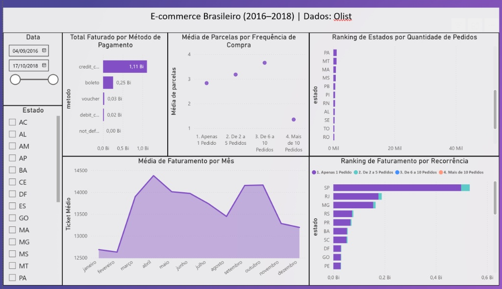
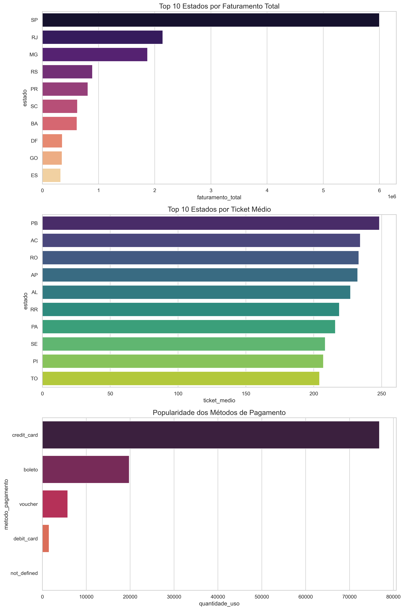

Análise de Fidelidade e Retenção - E-commerce (Olist Dataset)
Este projeto tem como objetivo analisar o comportamento de compra e os índices de fidelidade de clientes em uma base de dados de e-commerce brasileiro (Olist).

🖥️ Visualização do Dashboard Final
(Análise estratégica desenvolvida no Power BI Desktop)

🚀 Status do Projeto: Concluído
O projeto foi executado em três etapas principais:

Fase 1 (SQL): Extração, junção e modelagem de dados brutos.

Fase 2 (Python): Análise exploratória (EDA) e Feature Engineering para criação de faixas de recorrência de pedidos.

Fase 3 (Power BI): Construção de dashboard interativo com foco em indicadores de negócio (AOV e LTV).

📊 Principais Insights
Concentração de Faturamento: Grande dominância das regiões Sudeste e Sul no volume de vendas.

Comportamento de Crédito: Identificamos que clientes com maior fidelidade (recorrência) tendem a parcelar menos suas compras em comparação a novos usuários.

Índice de Fidelidade: A base apresenta uma taxa de recorrência de 3,12%, revelando uma oportunidade estratégica para campanhas de retenção e CRM.

Oportunidade de Ticket Médio: Regiões Norte e Nordeste apresentam tickets médios superiores, apesar do menor volume absoluto de pedidos.

🛠️ Tecnologias Utilizadas
SQL (MySQL/SQLite): Extração e modelagem dos dados.

Python (Pandas, Seaborn, Matplotlib): Tratamento, limpeza e visualização estatística de tendências.

Power BI: Storytelling de dados e criação de dashboards dinâmicos.

Jupyter Notebook: Documentação de todo o processo de tratamento de dados.

Este projeto foi desenvolvido como um estudo de caso para análise de indicadores de negócios e Ciência de Dados.

👤 Autor

José Antônio da Silva Estudante de Ciência de Dados (3º Semestre) na Faculdade Descomplica.

---

---

### 🤝 Conecte-se comigo
Para discussões sobre Engenharia de Dados, parcerias em projetos de Sports Analytics ou oportunidades profissionais:

---

